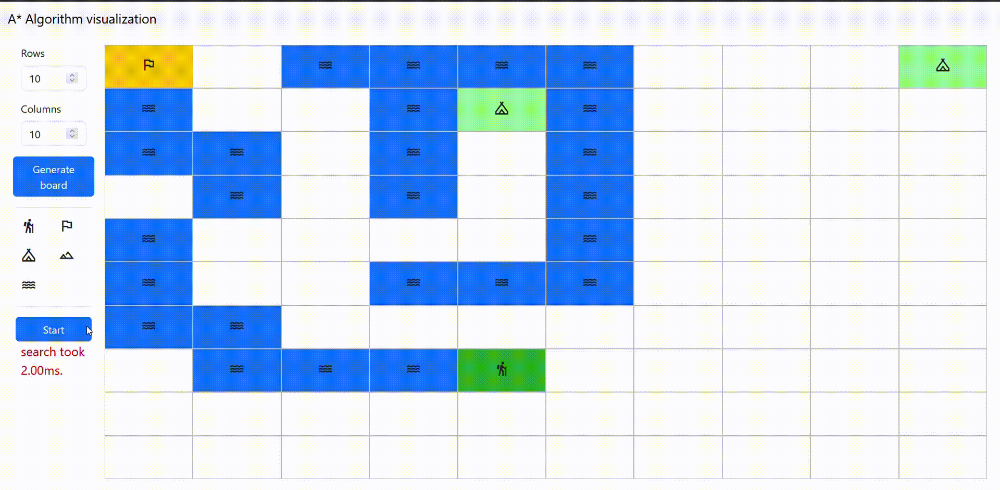
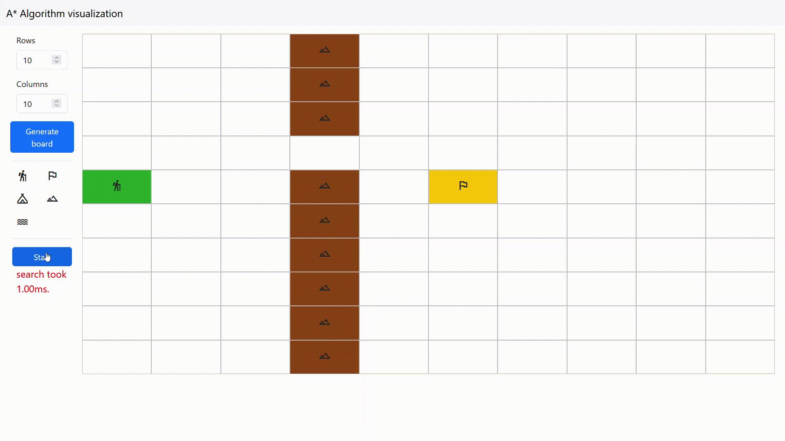
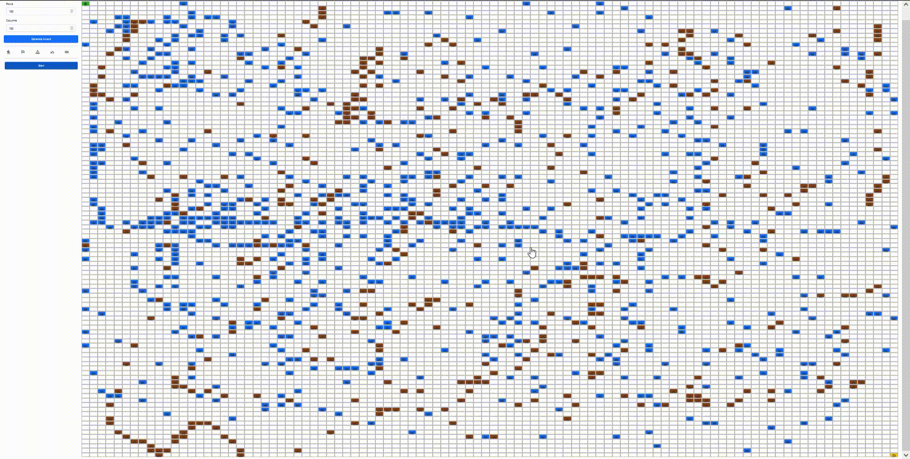

# Algoritmo A*
## Introducción

## Entorno
### Tecnologías
HTML, JavaScript, CSS

### Desarollo
VSCode con plugin Live Server

### Librerías
- Bootstrap: Framework CSS
- JQuery: Framework JavaScript

### Otras tecnologías
- GitHub: Control de versiones
- Whatsapp: Comunicación

## Implementación
### General
Se ha implementado un código de colores para poder diferenciar las diferentes casillas y sus estados. Los colores son los siguientes


### main.js
Contiene la lógica prinicpal de la página.

```
/** 
 * @param $graph - Div de cells
 * @param options - Numero de filas, columnas y si permitir diagonales
*/
GraphSearch($graph, options, implementation)
```

```
/** 
 * Crea el grid en la vista principal, asigna pesos a cells
*/
GraphSearch.prototype.initialize = function ()
```

```
/** 
 * Gestiona poner un ícono en un cell incluyendo:
 *  - Ícono
 *  - Nuevo peso (e.j. water, mountain)
 *
 * @param $cell - cell que se ha clickeado
*/
GraphSearch.prototype.cellClicked = function ($cell)
```

```
/** 
 * Empieza la busqueda. 
 * Si hay waypoints, gestiona los caminos entre waypoints.
*/
GraphSearch.prototype.search = function ()
```

### astar.js
Contiene la lógica de busqueda.

```
/**
* Busqueda A* en grafo dado comienzo y fin.
* @param {Graph} graph
* @param {GridNode} start
* @param {GridNode} end
*/
search: function (graph, start, end, )
```

### index.html
Contiene la estructura de la página web, y contiene todos los elementos visibles de la implementación.

### styles.css
Contiene los estilos de la página web (como por ejemplo colores  y reglas de diseño).

## Ampliaciones realizadas
### Waypoints
Se pueden añadir puntos intermedios que el senderista debe visitar. Esto se realiza por cercanía, es decir, se visita primero el más cercano al senderista, y una vez alcanzado, se vuelve a calcular cuál es el más cercano, y así sucesivamente hasta llegar a la meta. Si uno de estos waypoints es inaccessible, se saltará al siguiente.

**Caso Especial**

La busqueda de waypoints se realiza por distancia desde el nodo inicial. Esto causa que en ciertos casos no se calcule el camino más corto.

### Terreno difícil

Se puede añadir terreno difícil, que el senderista puede atravesar, pero con dificultad. Esto se realiza con un peso mayor a la celda convencional. Esto se consigue con un peso arbitrario de 3, haciendo que si atravesar una casilla difícil le ahorra al menos tres movimientos, el senderista lo hará.

## Ejemplos
### Tablero 50x50


*Velocidad x4*

*Tiempo de busqueda: 3.00ms*

### Tablero 100x100


*Velocidad x1*

*Tiempo de busqueda: 3.00ms*