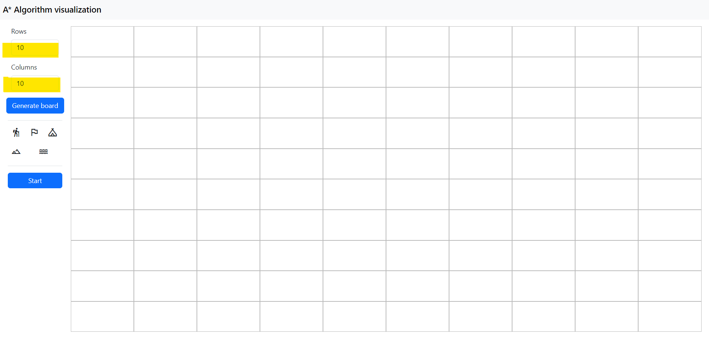
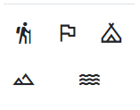
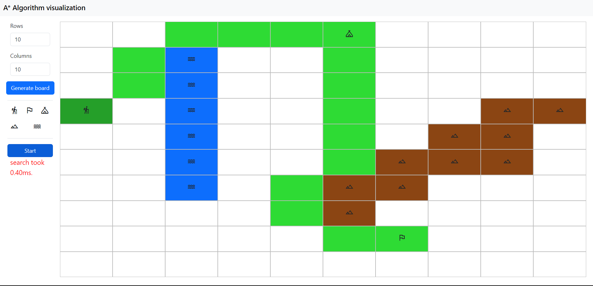

# Guía de usuario A*
## Interfaz del usuario:

### Selector
El selector cuenta con varios parámetros que se pueden modificar para la ejecución del algoritmo A*:
- las filas (rows) del tablero.
- las columnas (cols) del tablero.
##
Después, tenemos los iconos:

Que cumplen las siguientes funciones:
- El icono del senderista es el punto de comienzo del algoritmo.
- El icono de la bandera es el punto final del algoritmo. Si no puede alcanzarse, saltará el error ``no path found``.
- El icono de la montaña es un obstáculo que el senderista puede atravesar, pero con dificultad (peso 2).
- El icono del río es un obstáculo que el senderista no puede atravesar, y se considera terreno intransitable (peso 0).
- El icono de la tienda de campaña se considera 'waypoint', es decir, un punto intermedio que el senderista debe visitar. Esto se calcula por cercanía al senderista y en sus puntos.

### Tablero 
El tablero es el espacio donde se ejecuta el algoritmo A*. Se puede modificar el tamaño del tablero con el selector, y se puede modificar el terreno con los iconos. Cuando se ha encontrado un camino óptimo, este se marcará en el tablero con un color verde, que indicará las celdas visitadas por orden:

En este ejemplo podemos observar como el senderista ha encontrado el camino óptimo para llegar a la bandera, pasando por los waypoints y evitando los obstáculos. En caso de que un obstaculo con un peso excesivo lo salve de dar un rodeo, el senderista atraveserá el terreno difícil, si así consigue mejor tiempo.

